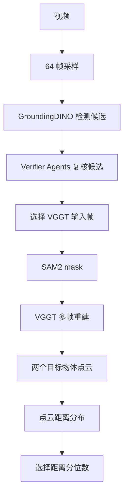

# Object Absolute Distance DADP Status

## Background

`object_abs_distance` 的问题形式是：

```text
Measuring from the closest point of each object,
what is the distance between object A and object B?
```

当前系统不让 LLM 直接估计米数，而是使用工具链计算距离：



现在讨论的 DADP 是最后一步：

```text
如何从两个物体点云的距离分布中选择一个代表距离。
```

DADP = Distribution-aware Adaptive Distance Pooling。

## Data

本轮分析使用 full-run 保存结果：

```text
runs/object_abs_distance_full_qwen25vl_gpu3_20260615_160000
```

分析样本：

```text
all object_abs_distance docs: 834
successful/evaluated docs: 771
```

分布分析文件：

```text
docs/tasks/object_abs_distance/distribution_analysis_full_20260615/per_doc_quantile_scores.csv
```

## Alias Fix Rerun

原 full run 中有 63 个 error 样本，其中主要问题是检测阶段没有候选：

```text
detector_zero_candidate: 62
post_selection_missing: 1
```

错误对象高度集中在 `trash bin`：

| 对象 | 次数 |
| --- | ---: |
| `trash bin` | 55 |
| `towel` | 2 |
| `bucket` | 2 |
| `stove` | 1 |
| `heater` | 1 |
| `pan` | 1 |

针对 `trash bin` 做单帧 probe 后发现，原始 query `trash bin` 经常没有框，但同一帧中 `trash can`、`garbage can`、`wastebasket` 等 alias 可以检测到正确目标。因此在 `LocalizeObjectsTool` 中加入轻量 alias expansion：

```text
先使用原始对象名检测；
只有当某个对象完全没有候选时，才使用 alias query 补检；
alias 检测结果映射回原对象名，后续 verifier / SAM2 / VGGT 流程保持不变。
```

当前 alias 表主要覆盖：

```text
trash bin/trash can
couch/sofa
tv/television
plant/potted plant/houseplant
```

修正后只重跑原来的 63 个 error 样本：

```text
runs/object_abs_distance_error63_alias_fix_gpu3_20260617
```

结果：

| 指标 | 数值 |
| --- | ---: |
| 重跑样本 | 63 |
| 新成功 | 47 |
| 仍失败 | 16 |
| error63 MRA | 26.19% |
| error63 success-only MRA | 35.11% |

将这 63 个重跑结果替换回原 full run 后：

```text
runs/object_abs_distance_full_alias_fix_merged_20260617
```

| 指标 | 原 full run | alias fix merged |
| --- | ---: | ---: |
| 总样本 | 834 | 834 |
| success/evaluated | 771 | 818 |
| full MRA | 29.17% | 31.15% |
| success-only MRA | 31.56% | 31.76% |
| within 25% | 214 | 228 |
| within 0.5m | 275 | 293 |

结论：

```text
alias expansion 主要修复检测召回问题，将全量 MRA 提升 +1.98。
但它不是距离估计精度修复；新恢复的 trash-bin 样本中仍有一部分长距离样本明显低估。
```

剩余 16 个失败样本仍然是：

```text
Selected frames did not include finite localizations for both objects.
```

对象分布：

| 对象 | 次数 |
| --- | ---: |
| `trash bin` | 9 |
| `door` | 3 |
| `table` | 3 |
| `backpack` | 2 |
| `bucket` | 2 |
| `towel` | 2 |
| `window` | 2 |

后续应继续针对剩余对象做 alias / referring probe，而不是直接改距离聚合。

## Alias Fix + DADP

在 alias fix merged 结果上重新生成分位数分析：

```text
docs/tasks/object_abs_distance/distribution_analysis_alias_fix_merged_20260617
```

并使用同一套 DADP-v2 5-fold CV：

```text
docs/tasks/object_abs_distance/dadp_v2_alias_fix_merged_20260617
```

alias fix 后成功样本数为 818。固定分位数结果：

| 方法 | success-only MRA |
| --- | ---: |
| `p25` | 15.06% |
| `median` | 22.86% |
| `p75` | 29.71% |
| `p90` | 31.76% |
| per-sample oracle | 48.81% |

继续使用 DADP 后：

| 方法 | success-only MRA | full MRA, 834 docs |
| --- | ---: | ---: |
| alias fix + fixed `p90` | 31.76% | 31.15% |
| alias fix + core2 | 32.59% | 31.97% |
| alias fix + core2 + `p90` far guard | 32.79% | 32.16% |
| alias fix + core2 + `median` far guard | 32.75% | 32.12% |
| alias fix + delta tree | 31.65% | 31.04% |

最佳仍然是：

```text
core2 + p90 far-distance guard
```

相对 alias fix 后固定 `p90`：

```text
success-only MRA: +1.03
full MRA: +1.01
```

相对最初 full run 固定 `p90`：

```text
29.17% -> 32.16%
总提升约 +2.99 MRA
```

switch-case：

| 项 | 数值 |
| --- | ---: |
| 切到 `p75` | 117 |
| 保持 `p90` | 701 |
| benefit | 38 |
| tie | 47 |
| harm | 32 |
| switch delta sum | +8.4 |

结论：

```text
alias expansion 与 DADP 是互补收益。
alias expansion 主要修复检测召回，将 47 个原 error 样本恢复为可评估；
DADP 继续在成功样本中识别 p90 偏大的 case，并回退到 p75。
当前组合 full MRA 约为 32.16%。
```

## Fixed Quantile Baseline

在 771 个成功样本上，固定分位数 MRA：

| 方法 | MRA |
| --- | ---: |
| `min` | `3.10%` |
| `p05` | `7.06%` |
| `p10` | `8.78%` |
| `p25` | `14.62%` |
| `median` | `22.67%` |
| `p75` | `29.66%` |
| `p90` | `31.56%` |

结论：

```text
固定 p90 是当前最强 baseline。
```

这说明当前点云距离分布并不是干净的“最近点距离”。如果直接取低分位数，容易受到误检、背景点、遮挡点、局部重建噪声影响。

## Oracle Upper Bound

如果每个样本都允许从分位数中选择 MRA 最高的一个，oracle MRA：

```text
48.61%
```

这说明“样本级选择分位数”存在明显上限空间。

### Oracle Single Tie-break Distribution

按 tie-break 只选一个最优分位数：

| 分位数 | 样本数 | 占比 |
| --- | ---: | ---: |
| `p90` | 550 | `71.34%` |
| `p75` | 77 | `9.99%` |
| `median` | 67 | `8.69%` |
| `p25` | 38 | `4.93%` |
| `p05` | 15 | `1.95%` |
| `p10` | 13 | `1.69%` |
| `min` | 11 | `1.43%` |

重要现象：

```text
oracle 大多数情况下仍然选择 p90。
收益主要来自少数样本中从 p90 切到 p75 / median / p25。
```

### Oracle By GT Distance Bucket

| GT 距离段 | 样本数 | 主要选择 |
| --- | ---: | --- |
| `<1m` | 140 | 分散，`p25/median/p75/p90` 都有 |
| `1-3m` | 443 | `p90` 为主，340/443 |
| `>=3m` | 188 | 几乎全是 `p90`，187/188 |

其中 `<1m`：

| 分位数 | 样本数 | 占比 |
| --- | ---: | ---: |
| `p25` | 32 | `22.86%` |
| `median` | 31 | `22.14%` |
| `p90` | 23 | `16.43%` |
| `p75` | 19 | `13.57%` |
| `p05` | 15 | `10.71%` |
| `p10` | 12 | `8.57%` |
| `min` | 8 | `5.71%` |

解释：

```text
近距离样本更需要自适应；
中远距离样本基本应该保持 p90。
```

## Tie Phenomenon

有一批样本在 MRA 指标下多个分位数并列最优。

| 并列分位数个数 | 样本数 | 占比 |
| --- | ---: | ---: |
| 1 | 489 | `63.42%` |
| 2 | 67 | `8.69%` |
| 3 | 4 | `0.52%` |
| 4 | 1 | `0.13%` |
| 7 | 210 | `27.24%` |

其中 `210/771` 个样本所有分位数 MRA 都并列。

这通常表示：

```text
模型误差太大，或者 GT 距离段下所有预测都落在同一个 MRA 档位。
```

因此训练 oracle label 时不能过度相信硬标签，需要考虑 margin-aware label。

## DADP-v1 Interpretation

第一版 DADP 不应理解为“自动选择任意最佳分位数”。

更准确的定位是：

```text
quality-aware p90 correction gate
```

也就是：

```text
默认相信 p90；
当距离分布形态或上游感知质量提示 p90 可能偏大时，
回退到 p75，少数情况回退到 median。
```

## Best Current Results

| 方法 | MRA |
| --- | ---: |
| fixed `p90` | `31.56%` |
| best rule gate | `31.70%` |
| full-feature shallow tree | `32.54%` |
| core-5 shallow tree | `32.54%` |
| core-2 shallow tree | `32.41%` |
| core-2 explicit two-threshold gate | `32.52%` |
| per-sample oracle | `48.61%` |

结论：

```text
DADP 已经显示出可泛化信号，但目前仍是弱有效。
```

`+0.96 ~ +0.99` MRA 的提升不大，但它是在固定 `p90` 这个强 baseline 上取得的。

## Feature Ablation

当前最有用的两个特征：

```text
skew
accepted_candidate_mean
```

含义：

| 特征 | 含义 |
| --- | --- |
| `skew` | 距离分布高尾相对中低分位数是否异常 |
| `accepted_candidate_mean` | verifier 后每个实例聚类中平均保留了多少候选，反映候选歧义/感知质量 |

消融结果：

| 配置 | 特征 | CV MRA |
| --- | --- | ---: |
| full all features | 全部 run/frame/quality 特征 | `32.54%` |
| core 5 | `skew, accepted_candidate_mean, lower_tail, iqr_norm, median` | `32.54%` |
| core 2 | `skew, accepted_candidate_mean` | `32.41%` |
| core + median | `skew, accepted_candidate_mean, median` | `32.58%` |
| core + iqr_norm | `skew, accepted_candidate_mean, iqr_norm` | `32.36%` |
| core + lower_tail | `skew, accepted_candidate_mean, lower_tail` | `32.39%` |
| no skew | 全部特征但去掉 `skew` | `30.91%` |
| no accepted_candidate_mean | 全部特征但去掉 `accepted_candidate_mean` | `31.17%` |
| distribution only | 只用距离分布特征 | `31.88%` |

结论：

```text
有效信号非常集中。
大部分 frame/run 级特征在当前浅层树中没有额外收益。
```

`skew` 和 `accepted_candidate_mean` 是关键。去掉任意一个都会低于固定 `p90`。

## Core-2 Gate

当前最值得分析的简化版本只用两个特征：

```text
skew
accepted_candidate_mean
```

当前建议只在两个分位数之间选择：

```text
p90
p75
```

规则形态：

```text
默认使用 p90

if skew 较高:
    use p75
elif accepted_candidate_mean 较高:
    use p75
else:
    use p90
```

5-fold 中学到的阈值范围：

```text
skew_threshold: 约 8.0 - 8.8
accepted_candidate_mean_threshold: 约 3.1 - 3.7
```

一个可先分析的固定参数：

```text
skew_threshold = 8.0
accepted_candidate_mean_threshold = 3.1
```

对应逻辑：

```text
if skew >= 8.0:
    use p75
elif accepted_candidate_mean >= 3.1:
    use p75
else:
    use p90
```

core-2 显式双阈值门控结果：

```text
CV MRA = 32.52%
选择 p75: 137/771
选择 p90: 634/771
```

说明：

```text
当前 DADP-v1 本质上是 p90 -> p75 的二选一修正。
```

## Failed More Complex Rule

尝试过更复杂的四象限阈值规则：

```text
skew < threshold / >= threshold
accepted_candidate_mean < threshold / >= threshold
每个象限分别选择 p25 / median / p75 / p90
```

结果：

| 规则 | CV MRA |
| --- | ---: |
| 四象限，允许 `p25/median/p75/p90` | `30.78%` |
| 四象限，只允许 `p75/p90` | `31.14%` |

这低于固定 `p90`。

解释：

```text
复杂规则在训练集上能拟合更高，但泛化变差。
当前样本量和特征质量不足以支持更细的区域划分。
```

## Current Findings

1. 固定 `p90` 是强 baseline。
2. oracle 中 `p90` 占 `71.34%`，说明不能大规模切换到低分位数。
3. 真正有价值的是识别少数 `p90` 偏大的样本。
4. 当前最有效信号是：
   - 距离分布形态：`skew`
   - 感知候选质量：`accepted_candidate_mean`
5. DADP-v1 目前最好解释为：

```text
quality-aware p90 correction gate
```

而不是完整的 best-quantile selector。

## Switch-case Analysis

对 core-2 gate 做了 `p90 -> p75` 切换样本分析。这里使用严格 5-fold 口径：每个 fold 只在训练集上学习两个阈值，然后统计验证集里的切换效果。

core-2 gate：

```text
features: skew, accepted_candidate_mean
action space: p90 / p75
CV MRA: 32.52%
fixed p90: 31.56%
```

5-fold 学到的阈值范围：

```text
skew_threshold: 7.98 - 8.81
accepted_candidate_mean_threshold: 3.08 - 3.74
```

验证集总计：

| 决策 | 样本数 |
| --- | ---: |
| keep `p90` | 634 |
| switch to `p75` | 137 |

137 个切换样本的结果：

| 结果 | 定义 | 样本数 |
| --- | --- | ---: |
| benefit | `mra_p75 > mra_p90` | 38 |
| tie | `mra_p75 == mra_p90` | 53 |
| harm | `mra_p75 < mra_p90` | 46 |

单看数量，harm 略多于 benefit。但看 MRA 幅度后，整体仍是正收益：

| 结果 | 样本数 | delta MRA 总和 | 平均 delta MRA |
| --- | ---: | ---: | ---: |
| benefit | 38 | `+15.8` | `+0.416` |
| tie | 53 | `0.0` | `0.000` |
| harm | 46 | `-8.4` | `-0.183` |
| total switch | 137 | `+7.4` | `+0.054` |

解释：

```text
gate 不是每次切换都正确；
但正确切换时收益更大，错误切换时损失较小，
因此整体 MRA 仍高于 fixed p90。
```

按触发原因看：

| trigger | 样本数 | benefit | tie | harm | delta MRA 总和 |
| --- | ---: | ---: | ---: | ---: | ---: |
| `skew` | 40 | 13 | 17 | 10 | `+4.6` |
| `accepted_candidate_mean` | 97 | 25 | 36 | 36 | `+2.8` |

结论：

```text
skew 触发更干净，平均收益更高；
accepted_candidate_mean 有信号，但噪声更大。
```

按 GT 距离段看：

| GT bucket | 样本数 | benefit | tie | harm | delta MRA 总和 |
| --- | ---: | ---: | ---: | ---: | ---: |
| `<1m` | 33 | 12 | 18 | 3 | `+5.1` |
| `1-3m` | 79 | 26 | 15 | 38 | `+2.9` |
| `>=3m` | 25 | 0 | 20 | 5 | `-0.6` |

结论：

```text
DADP-v1 的收益主要来自近距离样本；
中距离样本有正收益但噪声更大；
远距离样本基本不应该切换。
```

这支持一个更窄的下一版方向：

```text
先做 p90 -> p75 二分类 gate；
并增加距离段/置信度约束，避免 >=3m 样本误切。
```

输出文件：

```text
docs/tasks/object_abs_distance/dadp_core2_threshold_search/switch_cases_cv_gate.csv
docs/tasks/object_abs_distance/dadp_core2_threshold_search/switch_case_summary_cv_gate.json
```

## DADP-v2 Experiments

基于 switch-case 分析，做了下一轮 5-fold 实验：

1. core-2 gate。
2. core-2 + far-distance proxy guard。
3. delta-aware tree。
4. delta-aware tree + far-distance proxy guard。

输出目录：

```text
docs/tasks/object_abs_distance/dadp_v2_delta_aware
```

### Result Table

| 方法 | CV MRA | switch to p75 | keep p90 | benefit | tie | harm | switch delta |
| --- | ---: | ---: | ---: | ---: | ---: | ---: | ---: |
| fixed `p90` | `31.56%` | 0 | 771 | - | - | - | - |
| v1 core-2 | `32.52%` | 137 | 634 | 38 | 53 | 46 | `+7.4` |
| v2 core-2 + `p90` far guard | `32.85%` | 112 | 659 | 38 | 41 | 33 | `+10.0` |
| v2 core-2 + `median` far guard | `32.48%` | 131 | 640 | 39 | 47 | 45 | `+7.1` |
| v3 delta-aware tree | `31.52%` | 394 | 377 | 84 | 155 | 155 | `-0.3` |
| v4 delta-aware tree + `p90` far guard | `31.15%` | 194 | 577 | 39 | 74 | 81 | `-3.1` |
| v4 delta-aware tree + `median` far guard | `32.02%` | 197 | 574 | 42 | 85 | 70 | `+3.6` |

### Far Guard Finding

`p90` 作为 far-distance proxy 是有效的。规则形态：

```text
if p90 >= T_far:
    keep p90
else:
    apply core-2 p90->p75 gate
```

5-fold 中学到的 `T_far`：

```text
fold 0: 4.014
fold 1: 4.609
fold 2: 4.609
fold 3: 4.609
fold 4: 4.609
```

效果：

```text
v1 core-2: 32.52%
v2 core-2 + p90 far guard: 32.85%
```

解释：

```text
p90 far guard 主要减少了远距离/高预测距离样本的误切。
切换样本从 137 降到 112；
benefit 保持 38 不变；
harm 从 46 降到 33；
tie 从 53 降到 41。
```

因此，当前最好的 DADP-v2 仍然是显式规则，不是更复杂模型：

```text
if p90 >= about 4.6:
    use p90
elif skew high:
    use p75
elif accepted_candidate_mean high:
    use p75
else:
    use p90
```

### Delta-aware Tree Finding

delta-aware tree 的目标是直接预测：

```text
delta = mra_p75 - mra_p90
```

然后：

```text
if predicted_delta > 0:
    switch to p75
else:
    keep p90
```

但第一版实验失败：

```text
v3 delta-aware tree: 31.52%
```

主要问题：

```text
delta-aware tree 切换过多。
它把 394/771 个样本切到 p75，
导致 harm = 155，benefit = 84，
整体 switch delta = -0.3。
```

加入 far guard 后仍不稳定：

```text
v4 + p90 far guard: 31.15%
v4 + median far guard: 32.02%
```

结论：

```text
当前特征和样本规模还不足以支持自由的 delta-aware tree。
DADP-v2 应优先保留可解释的显式门控。
```

### Updated Current Best

当前最佳版本：

```text
DADP-v2: core-2 p90-to-p75 gate + p90 far-distance guard
```

性能：

```text
fixed p90: 31.56%
DADP-v1 core-2: 32.52%
DADP-v2 far-guard: 32.85%
```

这把提升从 `+0.96` MRA 扩大到：

```text
+1.30 MRA
```

新的方法定位：

```text
DADP-v2 是一个带远距离保护的 positive-utility p90 correction gate。
```

## Alternative Pooling Statistics

除了 hard switch，也评估了固定 `p75/p90` blend：

```text
d_blend = lambda * p90 + (1 - lambda) * p75
```

由于 full-run 结果没有保存完整 pairwise distance 数组，当前只能对已有的 `p75/p90` 做离线 blend；`p80/p85/iqm_75_90` 需要重跑后才能真实评估。

### Fixed Blend Result

在 771 个成功样本上，固定 blend 的离线 MRA：

| lambda for p90 | 含义 | MRA |
| ---: | --- | ---: |
| `0.00` | fixed `p75` | `29.66%` |
| `0.25` | `0.25*p90 + 0.75*p75` | `30.39%` |
| `0.50` | `0.50*p90 + 0.50*p75` | `30.99%` |
| `0.75` | `0.75*p90 + 0.25*p75` | `31.34%` |
| `1.00` | fixed `p90` | `31.56%` |

细粒度扫 `lambda ∈ [0, 1]` 后：

```text
best lambda = 0.94
best fixed blend MRA = 31.60%
```

结论：

```text
固定 soft blend 基本追不上 DADP。
最优 blend 只比 fixed p90 高约 +0.04 MRA，
远低于 DADP-v2 far-guard 的 32.85%。
```

这说明当前收益不是简单来自“把 p90 稍微往 p75 拉一点”，而是来自样本级的选择性 correction。

### Added Aggregates For Future Runs

已在 eval/tool 路径中加入以下 pointcloud aggregate：

```text
p80
p85
iqm_75_90
blend_p75_p90_25
blend_p75_p90_50
blend_p75_p90_75
```

同步修改位置：

```text
scripts/eval_vsibench_object_abs_distance.py
spatial_agent/tools/object_distance_3d.py
```

同时 `distance_stats` 现在会额外记录：

```text
p80
p85
```

下一步可以重跑小样本或 full-run，对比：

```text
fixed p80
fixed p85
iqm_75_90
blend_p75_p90_25/50/75
DADP-v2 far-guard
```

## Open Questions

1. `skew >= 8` 为什么对应 `p90` 偏大？
   - 需要抽样看距离分布和点云可视化。

2. `accepted_candidate_mean >= 3.1` 为什么应该回退到 `p75`？
   - 可能表示同一实例保留候选过多，mask/点云混入背景或多视角误差。

3. 近距离 `<1m` 样本中，为什么 oracle 分布很分散？
   - 可能存在真实接触、遮挡、尺度漂移、bbox 混入背景等多种模式。

4. `210/771` 个全分位数 MRA 并列样本是否应该从训练中降权？
   - 这些样本对学习 gate 的贡献可能很低。

5. 是否应该做 margin-aware label？
   - 只有当 `p75/median` 明显优于 `p90` 时才训练切换。

## Suggested Next Experiments

1. 固定 core-2 gate 参数，在 full-run 上输出切换样本列表。
   - 看 `p90 -> p75` 的样本到底是什么类型。

2. 对 `skew >= 8` 的样本做可视化。
   - 保存两个物体点云距离 histogram。
   - 保存 selected frames、bbox、mask。

3. 对 `accepted_candidate_mean >= 3.1` 的样本做错误分析。
   - 判断是否来自候选过多、实例混淆、错误 fallback。

4. 做 margin-aware DADP。
   - 默认 `p90`。
   - 只有当训练集中 `p75` 比 `p90` 明显好时才学习切换。

5. 补更直接的几何特征。
   - A->B / B->A 非对称距离。
   - 点云 extent / outlier ratio。
   - 多帧 quantile 稳定性。

## Result Paths

```text
Full run:
runs/object_abs_distance_full_qwen25vl_gpu3_20260615_160000

Distribution analysis:
docs/tasks/object_abs_distance/distribution_analysis_full_20260615

Best full-feature DADP:
docs/tasks/object_abs_distance/dadp_experiment_v2_frame_features_d2_l20

Core-2 DADP:
docs/tasks/object_abs_distance/dadp_core_two

Core-2 threshold search:
docs/tasks/object_abs_distance/dadp_core2_threshold_search
```

## 2026-06-18 VSI-Train DADP Update

### Train Data Run

已下载并解压 `VSI-Train-10k`，其中 `absolute_distance` 任务：

```text
annotations: /disk/wangzhe/VSI-Train-10k/vsi_train_10k.parquet
absolute_distance docs: 1430
unique videos: 1033
```

使用当前 `object_abs_distance` workflow 跑完整 train absolute-distance：

```text
runs/vsi_train_abs_distance_full_20260617_2115_gpu2
runs/vsi_train_abs_distance_full_20260617_2115_gpu3
```

分片结果：

| split | count | success | MRA | MAE |
| --- | ---: | ---: | ---: | ---: |
| gpu2 | 715 | 673 | 29.45% | 1.149m |
| gpu3 | 715 | 638 | 25.78% | 1.204m |
| merged | 1430 | 1311 | 27.66% success-only | 1.176m |

生成 train 分布分析：

```text
docs/tasks/object_abs_distance/distribution_analysis_vsi_train_abs_distance_20260618
```

train fixed quantile:

| quantile | MRA | MAE |
| --- | ---: | ---: |
| min | 2.43% | 2.074 |
| p05 | 6.03% | 1.903 |
| p10 | 7.82% | 1.838 |
| p25 | 12.50% | 1.679 |
| median | 19.12% | 1.442 |
| p75 | 26.99% | 1.259 |
| p90 | 30.12% | 1.176 |

train per-sample oracle over all quantiles:

```text
44.72%
```

### Train-on-Train, Eval-on-Test

用 train `1311` 个成功样本训练 DADP，再评估到 alias-fix test `818` 个成功样本：

```text
docs/tasks/object_abs_distance/dadp_train_on_vsi_train_20260618
```

test baseline:

| method | test success-only MRA |
| --- | ---: |
| fixed p90 | 31.76% |
| fixed p75 | 29.71% |
| p75/p90 oracle | 37.35% |

train 学出的简单 gate：

| method | test MRA | p75 switches | switch delta |
| --- | ---: | ---: | ---: |
| core2 | 32.79% | 149 | +8.4 |
| core2 + p90 far guard | 32.37% | 124 | +5.0 |
| core2 + median far guard | 32.60% | 136 | +6.9 |
| delta tree + p90 far guard | 31.55% | 42 | -1.7 |

结论：

```text
train 数据能学出可迁移的 p90->p75 gate。
但复杂 delta-tree 在 train 上更高、test 上更差，有过拟合迹象。
```

### Data Quality Findings

train 中大量样本对 `p90` vs `p75` 没有有效监督信号：

```text
train count: 1311
p75 clearly better than p90: 174
p75 clearly worse than p90: 335
near tie, |delta| <= 0.1: 802
all quantile MRA tie: 365
p90 zero MRA: 540
p75 zero MRA: 570
```

质量特征也支持这一点。近似 tie 样本通常目标定位质量更低：

| feature | benefit | harm | tie |
| --- | ---: | ---: | ---: |
| selected_quality_mean | 0.221 | 0.197 | 0.161 |
| selected_localized_ratio | 0.492 | 0.462 | 0.380 |
| both_object_frame_ratio | 0.251 | 0.222 | 0.182 |
| selected_error_ratio | 0.128 | 0.126 | 0.155 |

因此训练集不是简单“全是坏数据”，而是：

```text
大量弱监督/低质量样本 + 少量高收益强信号样本。
```

### Model Sweep

尝试过的模型：

```text
Ridge delta regressor
Logistic switch classifier
DecisionTree depth 2/3
RandomForest regressor
GradientBoosting regressor
XGBoost regressor
LightGBM regressor
```

普通模型 sweep：

```text
docs/tasks/object_abs_distance/dadp_model_sweep_train_on_vsi_train_20260618
```

最佳普通模型：

| model | train clean | test MRA | p75 switches | delta |
| --- | --- | ---: | ---: | ---: |
| decision_tree_d2 | non_tie | 32.60% | 155 | +6.9 |
| LightGBM | non_tie | 32.52% | 135 | +6.2 |

这些没有超过 `core2`。

### Cleanliness-Weighted DADP

进一步引入连续 cleanliness score，而不是只做 hard filtering：

```text
docs/tasks/object_abs_distance/dadp_cleanliness_weight_20260618
```

linear cleanliness 使用：

```text
selected_localized_ratio
both_object_frame_ratio
1 - selected_error_ratio
selected_quality_mean
det_score_mean
1 - verifier_reject_ratio
```

最佳训练方式：

```text
action space: {p75, p90}
model: DecisionTreeRegressor max_depth=3
target: delta = mra_p75 - mra_p90
sample_weight = max(abs(delta), 0.05) * cleanliness^2
drop lowest-quality samples: 0% or 10%
```

最佳结果：

| method | test MRA | p75 switches | benefit/tie/harm | switch delta |
| --- | ---: | ---: | ---: | ---: |
| fixed p90 | 31.76% | 0 | - | 0 |
| previous core2 | 32.79% | 149 | 47/57/45 | +8.4 |
| cleanliness-weighted dt3 | 33.24% | 87 | 41/21/25 | +12.1 |

提升：

```text
vs fixed p90: +1.48 MRA
vs previous core2: +0.45 MRA
```

关键结论：

```text
最佳策略不是 hard clean，而是 quality-aware sample weighting。
硬删低质量样本会丢掉一部分 hard case；连续质量加权更稳定。
```

### Median Experiment

尝试把动作空间扩展到：

```text
{median, p75, p90}
```

结果路径：

```text
docs/tasks/object_abs_distance/dadp_median_p75_p90_quality_weight_20260618
```

test fixed/oracle:

| method | MRA |
| --- | ---: |
| fixed p90 | 31.76% |
| fixed p75 | 29.71% |
| fixed median | 22.86% |
| oracle over median/p75/p90 | 42.43% |

oracle best counts:

| split | median | p75 | p90 |
| --- | ---: | ---: | ---: |
| train | 208 | 116 | 987 |
| test | 155 | 79 | 584 |

最佳三分类模型：

| model | test MRA | choices |
| --- | ---: | --- |
| RandomForest | 31.83% | median 36, p75 7, p90 775 |

结论：

```text
median 有明显 oracle 空间，但当前特征无法稳定识别该选 median 的样本。
直接三分类会引入大量错误切换，远不如 p90->p75 二分类 correction。
```

当前不建议将 `median` 放入默认动作空间。

### Far-Distance Guard

语义上远距离应该强制使用 `p90`，但当前没有可靠 proxy。

在 train 上检查真实 `>=3m` 识别：

| proxy rule | selected | true far | precision | recall |
| --- | ---: | ---: | ---: | ---: |
| p90 >= 3.0 | 14 | 8 | 0.571 | 0.023 |
| p75 >= 2.0 | 87 | 58 | 0.667 | 0.165 |
| median >= 2.0 | 27 | 23 | 0.852 | 0.065 |

test 上 previous core2 的真实远距离 switch：

```text
switches total: 149
GT >= 3m switches: 30
delta on GT >= 3m switches: -0.6
benefit/harm/tie: 0/5/25
```

结论：

```text
远距离误切存在，但当前分位数 proxy 召回太低。
far guard 可以保留为可选模块，但不建议默认启用。
需要补充更可靠的远距离识别特征，如点云 extent、相机轨迹跨度、对象点云深度范围、A/B 中心距离等。
```

### Current Recommendation

当前推荐 DADP-v2：

```text
只在 {p75, p90} 中选择。
默认 p90。
用 quality-aware delta regressor 判断何时回退 p75。
训练权重使用 max(abs(delta), 0.05) * cleanliness^2。
不默认启用 median。
不默认启用 far-distance guard。
```

当前最佳结果：

```text
test success-only MRA: 33.24%
full MRA estimate over 834 docs: 32.60%
```

相对最初 full-run：

```text
original full MRA: 29.17%
alias fix + cleanliness-weighted DADP estimated full MRA: 32.60%
total gain: +3.43 MRA
```

### New Result Paths

```text
VSI-Train absolute-distance run:
runs/vsi_train_abs_distance_full_20260617_2115_gpu2
runs/vsi_train_abs_distance_full_20260617_2115_gpu3

Train distribution analysis:
docs/tasks/object_abs_distance/distribution_analysis_vsi_train_abs_distance_20260618

Train-on-train eval-on-test:
docs/tasks/object_abs_distance/dadp_train_on_vsi_train_20260618

Model sweep:
docs/tasks/object_abs_distance/dadp_model_sweep_train_on_vsi_train_20260618

Cleanliness-weighted best:
docs/tasks/object_abs_distance/dadp_cleanliness_weight_20260618

Median action-space experiment:
docs/tasks/object_abs_distance/dadp_median_p75_p90_quality_weight_20260618
```
