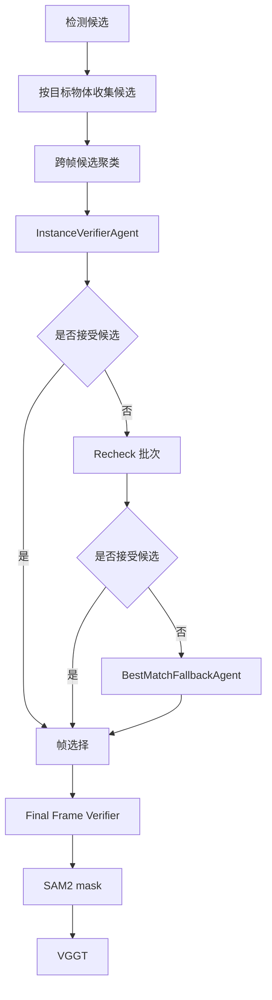

# Object Absolute Distance Verifier Agents

This note describes the current verifier path for VSI-Bench
`object_abs_distance`.

## Goal

The detector is treated as high-recall and noisy. Verifier agents should remove
clearly wrong detections, but should avoid deleting all candidates for an object
when the question requires that object to exist.

## Agents

### InstanceVerifierAgent

Runs before VGGT frame selection.

Input:

- contact sheet of candidate boxes for one requested object,
- candidate ids,
- detector scores,
- current question object list.

Output:

- accepted candidate ids,
- rejected candidate ids,
- corrected label or short reason.

Rules:

- Accept occluded, cropped, small, or partial objects if the category matches.
- Reject obvious category mismatch, background, or impossible candidates.
- Judge against the objects in the current question, not open-vocabulary labels.

### Recheck

Runs only when an object has no accepted instance candidates.

Input:

- score-ranked rejected candidates in batches.

Purpose:

- recover true positives that were rejected because of bad clustering or overly
  strict instance-level judgment.

### BestMatchFallbackAgent

Runs only after InstanceVerifierAgent and Recheck still accept zero candidates
for a required object.

Input:

- top candidate boxes for the missing object.

Output:

- exactly one `selected_candidate_id`.

Rules:

- Do not reject all candidates.
- Select the candidate that is most visually compatible with the requested
  object.
- Detector score is only a tie-breaker.
- If no candidate is perfect, choose the least-wrong / most semantically similar
  one among the current question objects.

### Final Frame Verifier

Runs after frame selection and before SAM2/VGGT.

Purpose:

- reject bad selected-frame boxes.
- resolve same-bbox conflicts between two target labels.

Special rule:

- If a region came from `BestMatchFallbackAgent`, preserve it and record
  `best_match_fallback_preserved` instead of rejecting it again.

## Workflow



## Switches

```bash
--enable-instance-verifier
--enable-instance-verifier-recheck
--enable-instance-verifier-best-match-fallback
--enable-final-frame-verifier
--verifier-model gpt-4o-mini
```

Useful fallback controls:

```bash
--instance-verifier-recheck-rounds 5
--instance-verifier-recheck-batch-size 6
--instance-verifier-recheck-all-rounds
--instance-verifier-best-match-candidates 12
```
