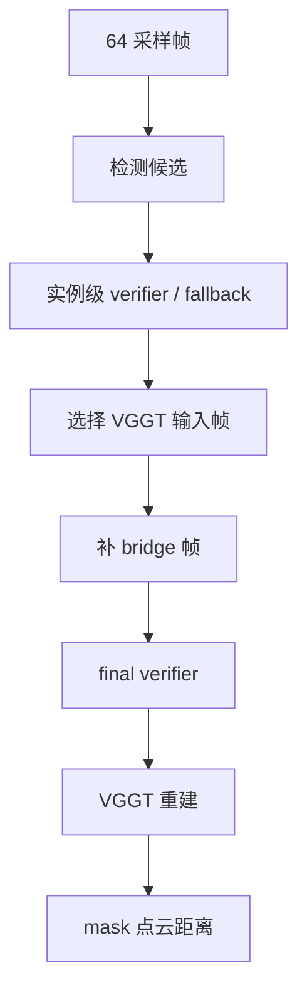

# Object Absolute Distance Frame Selection

This note records the current frame-selection policy for
`object_abs_distance`.

## Current Tool Path



## Selection Policy

The current practical policy is:

- keep high-quality same-frame detections when both objects appear together,
- keep top single-object frames for object A and object B,
- add sparse bridge frames between core frames,
- cap frames only when explicitly configured,
- run final verifier after selection.

Important options:

```bash
--top-distance-frames 0
--single-object-frames 2
--bridge-frames 5
--max-vggt-frames 0
```

Meaning:

- `top-distance-frames 0`: do not restrict same-frame candidates to a small
  top-k before single-object/bridge logic.
- `single-object-frames 2`: preserve core evidence for each object separately.
- `bridge-frames 5`: keep temporal continuity for VGGT when object A and object
  B appear in different frames.
- `max-vggt-frames 0`: no hard cap unless a specific experiment needs one.

## Why Bridge Frames Matter

VGGT reconstructs selected frames in one shared coordinate system. If two target
objects appear in distant, non-overlapping frames, sending only the object frames
can make reconstruction unstable.

Bridge frames give VGGT intermediate views between object A and object B.

## Why Not Send All Frames

Using too many frames can introduce:

- bad detections,
- empty masks,
- unrelated views,
- VGGT scale or alignment drift,
- noisy point clouds.

The workflow prefers a compact set of object-evidence frames plus sparse bridge
frames.

## Fallback Interaction

If verifier removes all candidates for one required object:

1. Recheck runs over rejected candidates.
2. If still missing, BestMatchFallbackAgent selects the most plausible candidate.
3. The fallback candidate is preserved through final verifier.
4. Frame selection can then include it as a normal object frame.

This is intended to recover from overly strict LLM rejection without disabling
the verifier path globally.

## Manual / LLM Frame Choice

The LLM should not estimate metric distance directly.

Reasonable LLM involvement:

- inspect candidate images and boxes,
- reject or recover detections,
- choose among candidate frames when used as a selector,
- explain the final tool-computed result.

Distance calculation remains tool-based.
