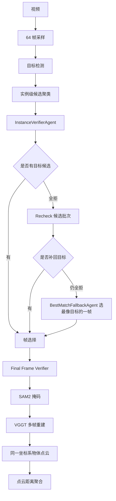

# Object Absolute Distance Progress

## Current Status

`object_abs_distance` now uses a tool-orchestrated workflow instead of asking the
LLM to estimate metric distance directly.

The LLM is used as a verifier/selector. Metric distance is computed by tools.

## Current Workflow



## LLM Role

- 判断检测框是否属于当前问题中的目标物体。
- 在跨帧候选聚类中拒绝明显错误实例。
- 当某个目标被全拒时，从候选中选出最匹配的一帧作为兜底。
- 不直接根据视频估计米数。

## Tool Role

- 目标检测提供高召回候选。
- SAM2 根据 bbox 生成目标 mask。
- VGGT 对选中帧做共享三维重建。
- 距离由两个物体 mask 对应的 3D 点云计算。

## Current Important Switches

```bash
--method mask_pointcloud_multiframe
--num-frames 64
--single-object-frames 2
--bridge-frames 5
--pointcloud-aggregate p90
--enable-instance-verifier
--enable-instance-verifier-recheck
--enable-final-frame-verifier
--enable-instance-verifier-best-match-fallback
--verifier-model gpt-4o-mini
```

## Notes

- 当前 verifier 默认使用 `gpt-4o-mini`。
- `best_match_fallback` 只在某个目标物体被全拒后触发。
- 被 fallback 选中的 region 会跳过普通 final reject，避免再次被同一拒识器删除。
- 兜底结果会记录在 `instance_verification.objects.<object>.best_match_fallback`。
